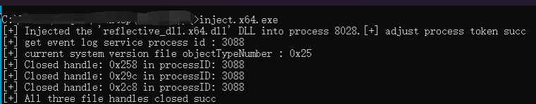

# rdll_EventCleaner

反射型DLL的windows日志清除工具

## 项目动机

在学习Windows日志单条删除时发现了一个很好的项目[EventCleaner](https://github.com/QAX-A-Team/EventCleaner)，其缺陷是`closehandle`操作只关注了`Security.evtx`文件，而忽略了`Application.evtx`和`System.evtx`文件，且实际使用时文件必须**落地**。

本项目对`Application.evtx System.evtx Security.evtx`三个文件均进行`closehandle`操作，且为了达到更加隐蔽的效果，采用了内存中执行的形式，具体操作方式是将其编译为`ReflectiveDLL`的形式。`ReflectiveDLL`即为反射式DLL，不少声称其无文件落地的后渗透操作都是利用该方法完成，其具体细节可参考原作者仓库 -- [ReflectiveDLLInjection](https://github.com/stephenfewer/ReflectiveDLLInjection).

## 测试截图

